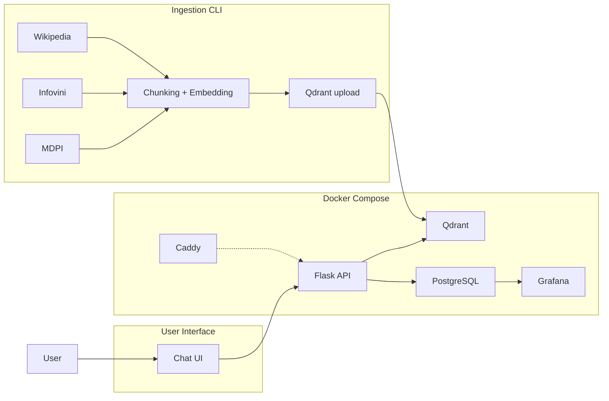
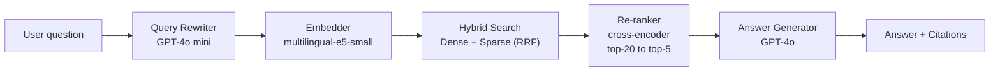

# Portuguese Food & Wine Guide

RAG assistant for Portuguese cuisine, traditional recipes, wine regions, and food-wine pairings.

## Quick Start

```bash
# 1. Clone and enter the project
git clone https://github.com/RuiFSP/llmzoomcamp-2026-final-project.git
cd llmzoomcamp-2026-final-project

# 2. Set your OpenAI API key
cp .env.example .env
# Edit .env and set OPENAI_API_KEY=sk-...

# 3. Start all services
docker compose up --build

# 4. In another terminal, ingest the knowledge base
docker compose exec api python -m src.ingestion.run

# 5. Open the chat UI
open http://localhost:5000
```

> First build downloads ML models (~500MB) — expect 2–3 minutes.

---

## Problem Statement

Tourists and food enthusiasts exploring Portuguese gastronomy face information scattered across multiple websites, languages, and formats. Traditional search engines return generic results with no synthesis; users must manually cross-reference recipes, wine recommendations, and regional context. This project solves that by providing a single conversational interface — in Portuguese — that retrieves relevant knowledge and generates coherent answers with citations.

The target users are tourists visiting Portugal, food enthusiasts curious about Portuguese cuisine, wine lovers exploring Portuguese wine regions, and anyone seeking reliable, cited information about Portuguese food and wine culture.

---

## Architecture



### Query Flow



---

## Tech Stack

| Component | Technology |
|---|---|
| **API** | Flask + Gunicorn |
| **Vector DB** | Qdrant (dense + sparse hybrid search) |
| **Metadata / Logs** | PostgreSQL 16 |
| **Monitoring** | Grafana (8 panels, PostgreSQL datasource) |
| **Embeddings** | `intfloat/multilingual-e5-small` (384-dim, in-process) |
| **Sparse Retrieval** | BM25 via `rank-bm25` |
| **Re-ranker** | `cross-encoder/ms-marco-MiniLM-L-6-v2` |
| **Query Rewriter** | GPT-4o mini |
| **Answer Generator** | GPT-4o |
| **Orchestration** | Docker Compose (5 services + optional Caddy) |
| **Cloud Reverse Proxy** | Caddy (auto TLS via Let's Encrypt, profile: `cloud`) |

---

## Data Sources

| Source | Description | Content |
|---|---|---|
| **Wikipedia PT** | "Gastronomia de Portugal" article | Portuguese cuisine, regional dishes, traditional recipes |
| **Wikipedia EN** | "Portuguese cuisine" + "List of Portuguese dishes" | English-language coverage of Portuguese gastronomy |
| **Infovini** | Scraped wine portal | Wine regions, grape varieties, wine-food pairings |
| **MDPI Recipe Dataset** | Academic recipe dataset (1382 recipes, CC-BY) | Structured Portuguese recipe data with ingredients |

---

## Setup & Running

### Prerequisites

- Docker and Docker Compose v2
- An OpenAI API key with access to GPT-4o and GPT-4o mini

### Details

- **Grafana:** available at `http://localhost:3000` (login: `admin` / `admin`)
- **First build:** downloads two ML models (~500MB) cached in the Docker layer
- **Reset ingestion:** re-run with `--reset` to delete and re-ingest all data

```bash
docker compose exec api python -m src.ingestion.run --reset
```

---

## Usage Examples

The UI is in Portuguese (PT-PT). Here are example questions you can ask:


*Chat interface showing a question and answer with citations.*

| Pergunta | Resposta esperada |
|---|---|
| O que é o cozido à portuguesa? | Explica o prato tradicional com carnes, enchidos e vegetais cozidos. |
| O que é a caldo verde? | Descreve a sopa com couve galega, batata, cebola, alho e chouriço. |
| O que são vinhos generosos? | Explica o que são vinhos generosos portugueses como Porto e Madeira. |
| Quais são as castas mais plantadas em Portugal? | Lista as castas brancas e tintas mais cultivadas. |
| Quais são as principais regiões vitivinícolas de Portugal? | Lista Vinho Verde, Douro, Dão, Bairrada, Alentejo, Península de Setúbal, Lisboa e Algarve. |

---

## Evaluation Results

### Retrieval Metrics

| Strategy | Hit Rate@1 | Hit Rate@3 | Hit Rate@5 | MRR@10 |
|---|---|---|---|---|
| Dense only (e5-small) | 11% | 33% | 48% | 0.34 |
| Sparse only (BM25) | 7% | 26% | 41% | 0.28 |
| Hybrid (RRF fusion) | 15% | 37% | 52% | 0.39 |
| Hybrid + Re-ranker | 19% | 44% | 48% | 0.36 |

### LLM Answer Quality

| Metric | Score |
|---|---|
| Relevance (1–5) | 3.04 / 5 |
| Faithfulness (1–5) | 5.00 / 5 |

> Evaluated on a test set of 27 curated QA pairs (Wikipedia, Infovini, MDPI). Retrieval metrics across k=[1,3,5,10]. LLM quality scored by GPT-4o-mini-as-judge. See `notebooks/` for reproduction.

### Ingestion Output


*Terminal output showing the ingestion pipeline with 1514 chunks and 1514 vectors.*

---

## Monitoring

Grafana is auto-provisioned with a PostgreSQL datasource and a pre-built dashboard (`dashboards/food-wine-dashboard.json`) containing 8 panels:

| Panel | Type | Description |
|---|---|---|
| Query Throughput | Time series | Requests per hour |
| Retrieval Latency (ms) | Time series | Average retrieval latency per hour |
| LLM Latency (ms) | Time series | Average LLM generation latency per hour |
| Token Usage | Time series | Prompt and completion tokens per hour |
| Error Rate (%) | Stat | Percentage of requests with exceptions |
| Total Queries | Stat | Total questions asked |
| Feedback Score (avg) | Stat | Average feedback score |
| Total Response Time (ms) | Time series | End-to-end latency per hour |

User feedback is collected via the `POST /api/feedback` endpoint.


*Grafana dashboard showing 8 panels with real-time metrics from the RAG system.*

---

## Cloud Deployment

The same Docker Compose stack runs on a cloud VM with Caddy for automatic TLS termination.

### Requirements

- A DigitalOcean $6/mo droplet (or equivalent), Ubuntu 22.04+
- A domain name pointing to the VM's IP (required for HTTPS)

### Steps

```bash
# 1. Provision the VM (installs Docker)
./deploy/provision.sh root@<vm-ip>

# 2. Deploy the stack (rsync + docker compose up)
./deploy/deploy.sh root@<vm-ip> your-domain.com
```

The Caddy reverse proxy is activated via the `cloud` Compose profile:

```bash
export COMPOSE_PROFILES=cloud
export DOMAIN=your-domain.com
docker compose up -d --build
```

### Endpoints (Cloud)

| Service | URL |
|---|---|
| Chat UI | `http://<vm-ip>:5000` or `https://your-domain.com` |
| API health | `http://<vm-ip>:5000/api/health` |
| Grafana | `http://<vm-ip>:3000` (admin / admin) |

---

## Best Practices

- **Hybrid Search:** Dense (e5-small embeddings) + sparse (BM25) combined via Reciprocal Rank Fusion (RRF) for robust retrieval across query styles.
- **Cross-encoder Re-ranking:** Top-20 hybrid results are re-scored by a cross-encoder (`ms-marco-MiniLM-L-6-v2`), returning the top-5 most relevant chunks.
- **Query Rewriting:** User questions are reformulated by GPT-4o mini into standalone, search-optimized queries, improving retrieval for conversational or ambiguous questions.
- **Lazy Model Loading:** The cross-encoder model loads on first request, reducing startup memory usage.
- **Error Logging:** All request metrics (latency, tokens, errors) are logged to PostgreSQL for monitoring via Grafana.

---

## Project Structure

```
src/
  ingestion/       Scrapers (Wikipedia, Infovini, MDPI), chunking, embedding, Qdrant index
  search/          BM25, dense search, hybrid fusion (RRF), cross-encoder re-ranker, query rewriter
  api/             Flask app, routes, PostgreSQL DB layer, answer generation, static chat UI
  evaluation/      Test set with 27 curated QA pairs
notebooks/         Evaluation notebooks (retrieval + LLM metrics)
dashboards/        Grafana provisioning (datasource, dashboard JSON)
docker/            Dockerfile, Caddyfile (cloud TLS), init-db.sql
deploy/            provision.sh (install Docker on VM), deploy.sh (rsync + compose up)
data/              Raw data (MDPI zip), mounted at /app/data in container
.github/           CI/CD workflow (ruff lint + Docker build)
```

---

## Evaluation Criteria

See [EVALUATION.md](EVALUATION.md) for the LLM Zoomcamp 2026 final project scoring checklist.
