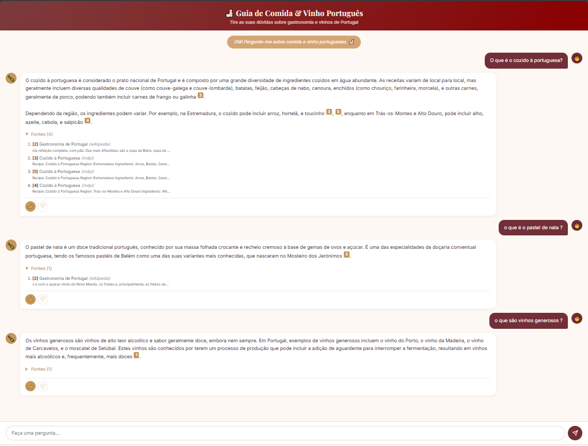
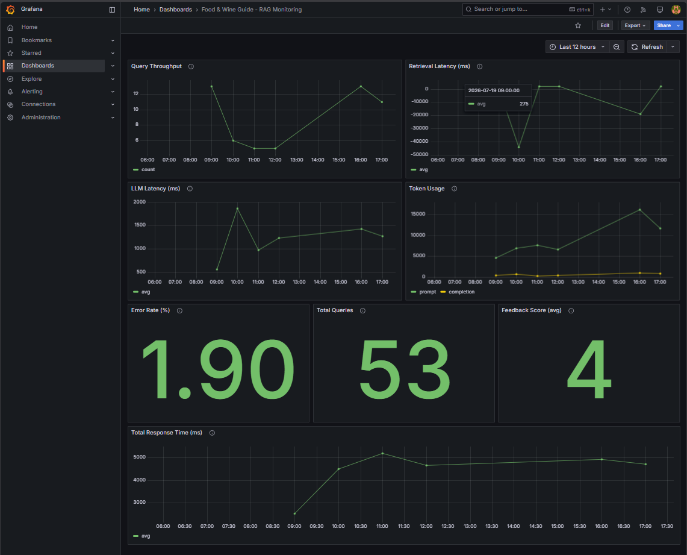
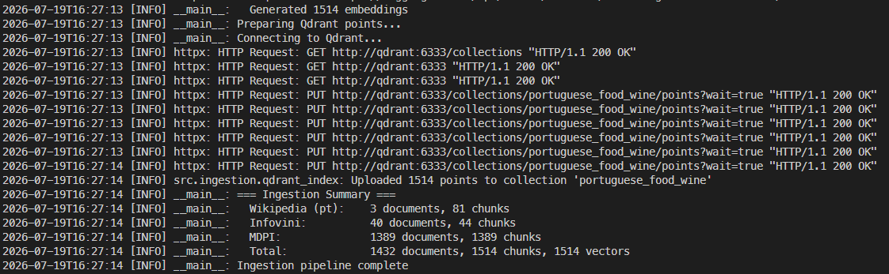
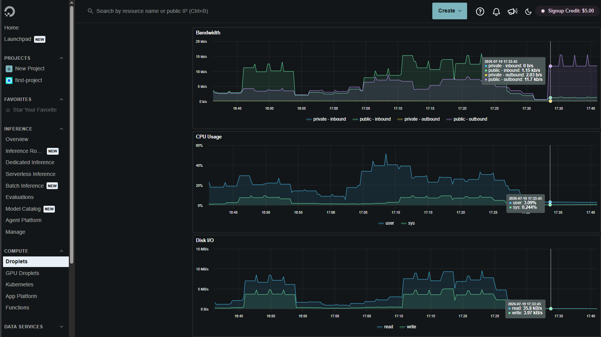

# Portuguese Food & Wine Guide

RAG assistant for Portuguese cuisine, traditional recipes, wine regions, and food-wine pairings. Built for **LLM Zoomcamp 2026**.

## Quick Start

```bash
# 1. Clone and enter the project
git clone https://github.com/RuiFSP/llmzoomcamp-2026-final-project.git
cd llmzoomcamp-2026-final-project

# 2. Set your OpenAI API key
cp .env.example .env
# Edit .env and set OPENAI_API_KEY=sk-...

# 3. Start all services
docker compose up --build

# 4. Ingest the knowledge base
docker compose exec api python -m src.ingestion.run

# 5. Open the chat UI
open http://localhost:5000
```

> First build downloads ML models (~500MB) — expect 2–3 minutes.

## Table of Contents

- [Architecture & Tech Stack](docs/architecture.md)
- [Ingestion Pipeline](docs/architecture.md#ingestion-pipeline)
- [Evaluation Results](docs/evaluation.md)
- [Monitoring (Grafana)](docs/monitoring.md)
- [Cloud Deployment](docs/deployment.md)
- [Limitations & Future Improvements](docs/limitations.md)

## Screenshots

| Chat Interface | Grafana Dashboard | Ingestion Pipeline | Cloud Deployment |
|---|---|---|---|
|  |  |  |  |

## Project Structure

```
src/
  ingestion/       Scrapers (Wikipedia, Infovini, MDPI), chunking, embedding, Qdrant index
  search/          BM25, dense search, hybrid fusion (RRF), cross-encoder re-ranker, query rewriter
  api/             Flask app, routes, PostgreSQL DB layer, answer generation, static chat UI
  evaluation/      Test set with 27 curated QA pairs
notebooks/         Evaluation notebooks (retrieval + LLM metrics)
dashboards/        Grafana provisioning (datasource, dashboard JSON)
docker/            Dockerfile, Caddyfile (cloud TLS), init-db.sql
deploy/            provision.sh (install Docker on VM), deploy.sh (rsync + compose up)
docs/              Detailed documentation (architecture, evaluation, monitoring, deployment, limitations)
data/              Raw data (MDPI zip), mounted at /app/data in container
.github/           CI/CD workflow (ruff lint + Docker build)
```

## Problem Statement

Tourists and food enthusiasts exploring Portuguese gastronomy face information scattered across multiple websites, languages, and formats. This project provides a single conversational interface — in Portuguese — that retrieves relevant knowledge and generates coherent answers with citations.

## Tech Stack

| Component | Technology |
|---|---|
| **API** | Flask + Gunicorn |
| **Vector DB** | Qdrant |
| **Logs & Metadata** | PostgreSQL 16 |
| **Monitoring** | Grafana (8 panels) |
| **Embeddings** | `intfloat/multilingual-e5-small` |
| **Sparse Retrieval** | BM25 via `rank-bm25` |
| **Re-ranker** | `cross-encoder/ms-marco-MiniLM-L-6-v2` |
| **Query Rewriter** | GPT-4o mini |
| **Answer Generator** | GPT-4o |
| **Orchestration** | Docker Compose + optional Caddy |

## Evaluation Criteria

See [EVALUATION.md](EVALUATION.md) for the LLM Zoomcamp 2026 final project scoring checklist.
