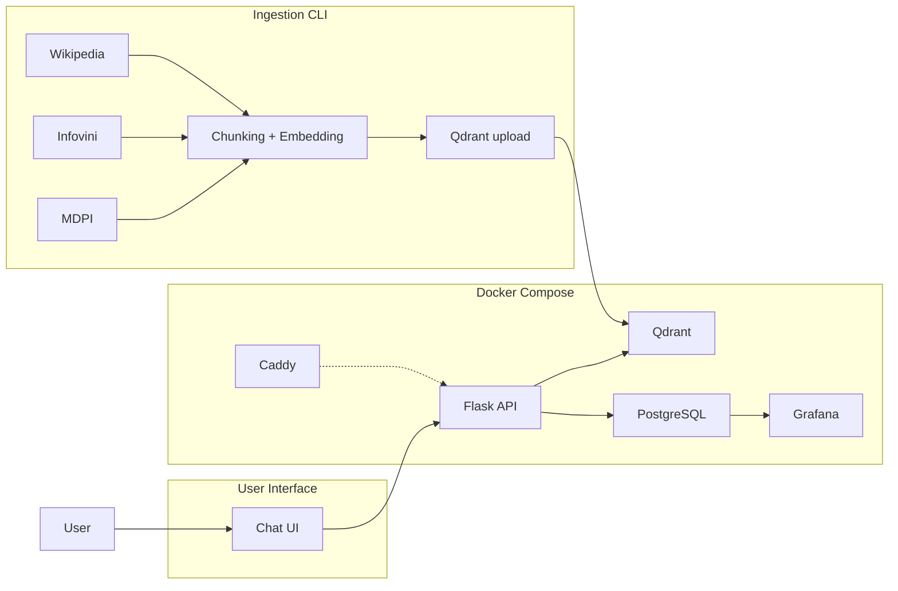
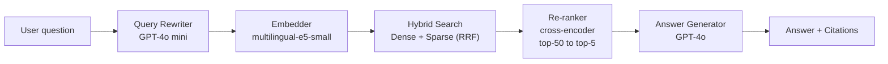

# Architecture

## System Overview



## Query Flow



## Tech Stack

| Component | Technology |
|---|---|
| **API** | Flask + Gunicorn |
| **Vector DB** | Qdrant (dense + sparse hybrid search) |
| **Metadata / Logs** | PostgreSQL 16 |
| **Monitoring** | Grafana (8 panels, PostgreSQL datasource) |
| **Embeddings** | `intfloat/multilingual-e5-small` (384-dim, in-process) |
| **Sparse Retrieval** | BM25 via `rank-bm25` |
| **Re-ranker** | `cross-encoder/ms-marco-MiniLM-L-6-v2` |
| **Query Rewriter** | GPT-4o mini |
| **Answer Generator** | GPT-4o |
| **Orchestration** | Docker Compose (5 services + optional Caddy) |
| **Cloud Reverse Proxy** | Caddy (auto TLS via Let's Encrypt with a domain, profile: `cloud`) |

## Data Sources

| Source | Description | Content |
|---|---|---|
| **Wikipedia PT** | "Gastronomia de Portugal" article | Portuguese cuisine, regional dishes, traditional recipes |
| **Wikipedia EN** | "Portuguese cuisine" + "List of Portuguese dishes" | English-language coverage of Portuguese gastronomy |
| **Infovini** | Scraped wine portal | Wine regions, grape varieties |
| **MDPI Recipe Dataset** | Academic recipe dataset (1389 recipes, CC-BY) | Structured Portuguese recipe data with ingredients |

## Technology Decisions

We evaluated several tools from the LLM Zoomcamp course and opted not to use them for these reasons:

| Tool | Considered For | Decision |
|---|---|---|
| **LangChain** | Framework for LLM chains and agents | Not used. Our retrieval pipeline is simple and well-suited to direct API calls. Adding LangChain would add abstraction without benefit. |
| **dlt** | Data ingestion pipeline with schema validation | Not used. Our data sources are static (Wikipedia, Infovini scrape, MDPI zip). No incremental loading needed. A Python CLI is sufficient. |
| **Kestra** | Workflow orchestration and scheduling | Not used. Ingestion runs once per deployment. No recurring schedules or complex dependencies to manage. |
| **PGVector** | Vector search inside PostgreSQL | Not used. Qdrant is purpose-built for vector search and keeps the stack modular. PGVector would eliminate a service but couples vector search to PostgreSQL. |
| **MinSearch** | In-memory keyword search (course module 1) | Not used. BM25 via `rank-bm25` provides better ranking and scales beyond in-memory datasets. |

## Ingestion Pipeline

```bash
docker compose exec api python -m src.ingestion.run
```

The ingestion CLI:
1. Fetches 3 Wikipedia articles (PT + EN)
2. Scrapes Infovini wine regions and 39 grape varieties
3. Parses 1389 MDPI recipes from the local ZIP file
4. Chunks all documents (1024 chars, 128 overlap)
5. Generates embeddings via multilingual-e5-small
6. Uploads to Qdrant collection `portuguese_food_wine`

**Output:** 1432 documents → 1514 chunks → 1514 vectors
